#  Rastreamento de consumo e desperdício de energia Back End
Exemplo simples de back-end com mockup de dados JSON e funcionalidades CRUD padrão

---

## Tecnologias
- **Node.sj**
- **JavaScript**
- **VsCode**
- **VsCode** Thunder Client

---

## Passos para testar
- 1º Clone este repositório
- 2º Abra com **VsCode** e em um terminal digite:
```bash
npm install
npm run dev
```
- 3º Teste as rotas com a extensão `Thunder Client` do **VsCode**
- 4º Abra o arquivo client/index.html com a extensão `Live Server` do **VsCode**

---

## Print dos testes e exemplo de requisições
- Cadastrar e Resultado
 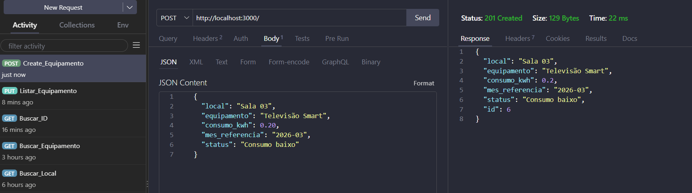
 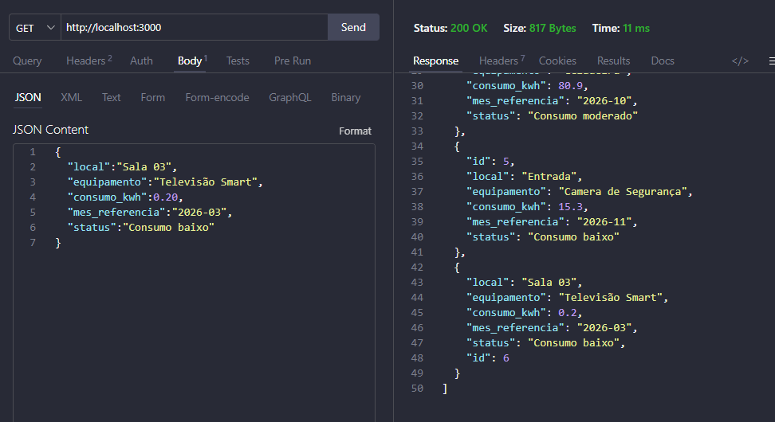

- Listar
 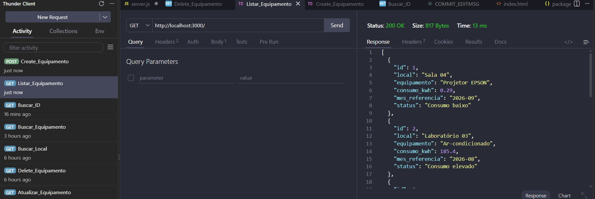

- Buscar por ID
 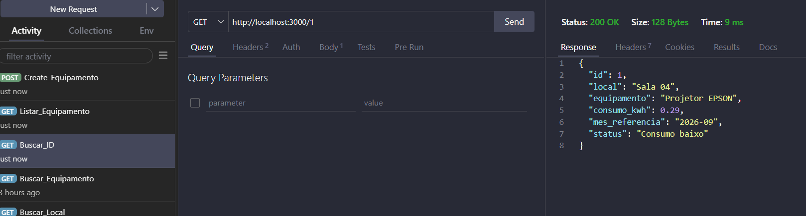

- Buscar por Equipamento
 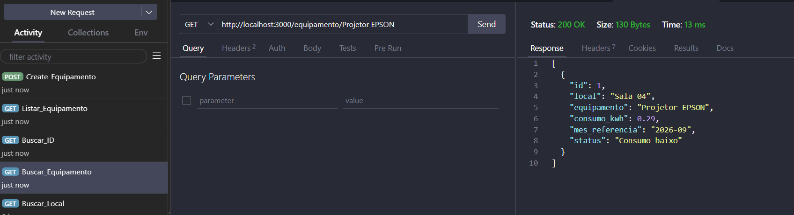

 - Buscar por Local
  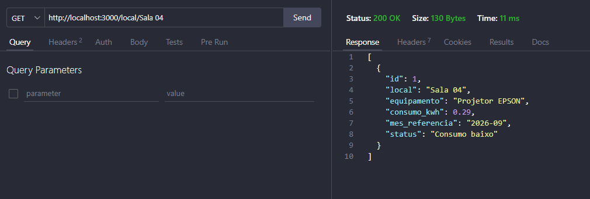

- Atualizar  e Resultado
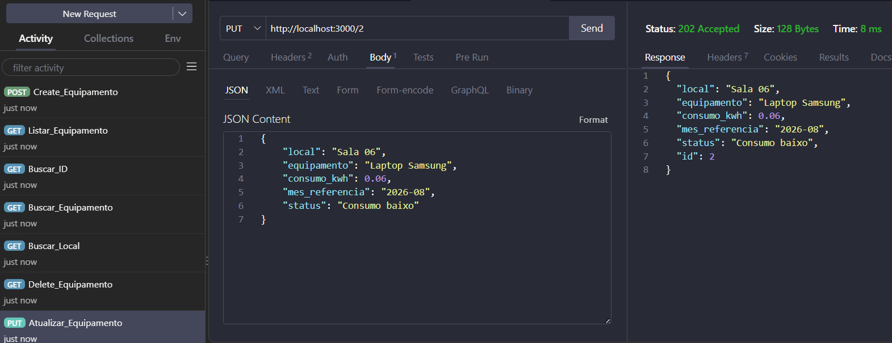
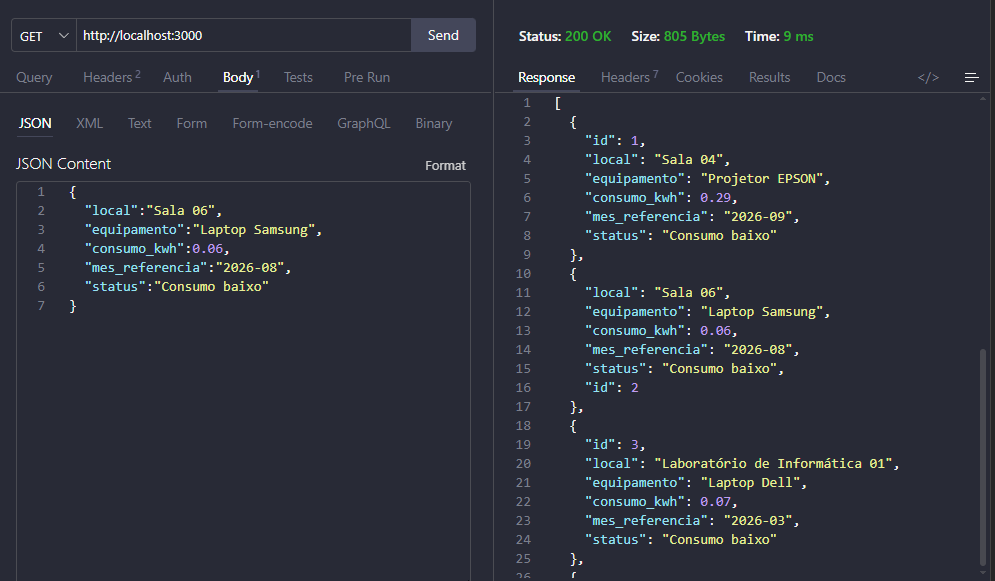

- Excluir e Resultado
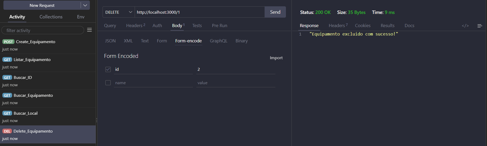
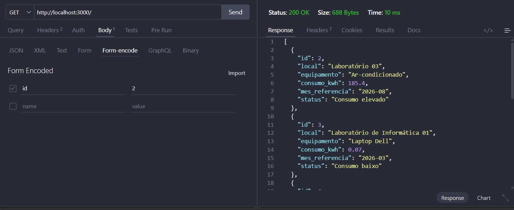

---

## Ciente
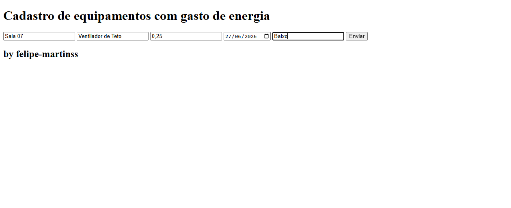
- Resposta:
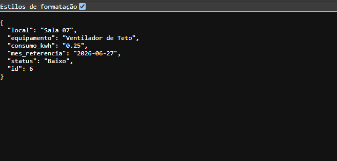
